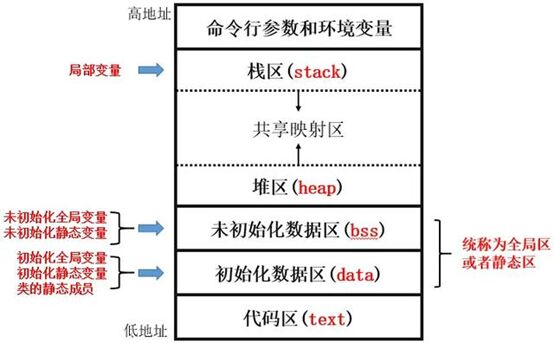

# 内存模型

## 对象在内存中的存储
### 栈区
存储局部变量、函数的调用信息等内容，由编译器管理，栈区可以分配的内存容量较小，如果在函数内创建过大的数组，或是递归函数没有终止条件，则会发生栈溢出，导致程序崩溃
### 堆区
存储动态分配的对象，由程序员负责管理，容易造成内存泄漏，但可以使用的内存容量较大
### 全局区
存储全局变量、静态类成员等内容，这些内容在整个程序运行过程中都存在，由编译器管理，在代码中未初始化的全局变量会被自动初始化为 0
#### 常量区
全局区的一个子区域，存储各种常量
#### 代码区
全局区的一个子区域，存储函数代码
#### 池？需要操作系统介入
# 裸指针
裸指针即通常语境下的“指针”，它是用来保存内存地址的变量，每个`T`类型的对象都有对应的指针类型`T *`，称为：指向`T`的指针，指针变量本身也需要占用内存空间，指针变量的大小只和机器字长有关，在 32 位和 64 位操作系统上，指针变量分别占 4 个字节和 8 个字节，这个大小和指针所指向的类型无关

`*`可以紧贴着`T`写，即`T*`，这样能让它看起来更像一个数据类型，`T *`和`T*`都可以用于声明指针变量
## 指针的基本使用
```cpp
int a = 10;
int *p1 = &a;
int* p2 = &a;
std::cout << p1 << '\n';
// 输出变量 a 的地址
```
上列代码片段中，我们创建了类型为`int *`的指针变量`p1, p2`，它们都保存了变量`a`在内存中占用的第一个内存单元的地址，简称：变量`a`的地址，它是一个 16 进制的整数

`&`是取址运算符，用于获取对象的地址，它的返回值类型是`T *`，即`T *`类型的指针变量可以保存任何类型为`T`的变量的地址

如果我们使用逗号运算符连续声明指针变量，那么不能把`T*`当作一个类型，应当让`*`紧贴着每个变量名，否则只有第一个变量才是`T *`类型，后续变量都是`T`类型
```cpp
int a = 10;
int *p1 = &a, *p2 = &a;  // 正确做法
int* p1 = &a,  p2 = &a;  // 编译错误，因为 p2 是 int 类型
```
在创建指针的时候，应当要立即对指针进行初始化，如果暂时不确定应该用它来保存哪个变量的地址，则应该使用空指针常量`nullptr`将其设置为空指针
```cpp
int *p1;           // 不好的做法
int *p2 = nullptr; // 良好的做法
```
未经初始化的指针称为野指针，上列代码片段中，`p1`就是野指针

我们可以通过间接寻址运算符，即`*`运算符，来访问指针所指向的内存中的内容，这样的操作称为解引用，必须明确的是，对野指针或空指针的解引用操作都是未定义行为

那为什么我们还要将指针置空？这是因为，有很多方法可以检测并控制空指针，但无法检测和区分野指针和正常指针，因为野指针可能保存任意地址
```cpp
int a = 10;
int* p = &a;
std::cout << *p << '\n';
// 输出 10
```
上列代码片段中，`*p`是一个左值表达式，也就是说，我们不仅可以使用这块内存中的内容，还可以对其进行修改
```cpp
int a = 10;
int* p = &a;
*p = 20;
std::cout << *p << '\n';
// 输出 20
std::cout << a << '\n';
// 输出 20
```
我们可以观察到，变量`a`的值也被改变了，我们通过指针`p`修改了变量`a`所在内存的内容

对指针变量运用取址运算符`&`，就可以得到指针变量的地址，它的类型是`T **`，这样的操作可以一直进行下去，从而得到`T **...`类型，即指向指针的指针，这种类型的变量称为多重指针，下列代码片段是一个双重指针的例子
```cpp
int a = 5;
int* p1 = &a;
int** p2 = &p1;
std::cout << *p2 << '\n' << **p2 << '\n';
// 输出 
//      指针变量 p1 的地址
//      5
```
## 无类型指针
我们还可以声明不指向任何类型的指针，称为无类型指针，这种指针的类型是`void *`，这样的指针可以保存任何地址，并且只能用来保存地址，不能进行解引用
```cpp
int a = 100;
int* p1 = &a;
void* p2 = &p1;
std::cout << *p2; // 编译错误
```
如果要使用无类型指针保存的地址，需要先将它强制转换为指向完整类型的指针，再进行解引用，但这样极易出现问题，例如，假设无类型指针保存的是`int`类型变量的地址，该地址指向的内存块大小是 4 个字节，如果将其转换成`long long *`后写入一个整数，将会写入 8 个字节，这样的行为就是越界访问内存，因此，在这之前必须先明确该地址指向的内存块的大小，再谨慎进行操作
```cpp
int a = 20;
void* p = &a;
*(int*)p = 200;
std::cout << a << '\n';
// 输出 200
```
## 动态内存分配
分配动态内存需要使用 $new$ 关键字，例如，动态分配一块 $sizeof(int)$ 大小的内存用于保存 $1$ 个 $int$ 类型变量，并将这块内存首字节的地址返回给一个指向 $int$ 的指针变量
```cpp
int* ptr1 = new int;
```
直接输出 $*ptr1$ 会得到这块内存原来就有的内容，这和声明变量后不初始化直接输出是一样的效果，如果要修改这块内存中的内容，需要通过指针的间接寻址
```cpp
std::cout << ptr1 << " " << *ptr1 << "\n";
// 输出 这块内存首字节的地址 任意值
*ptr1 = 0;
std::cout << ptr1 << " " << *ptr1 << "\n";
// 输出 这块内存首字节的地址 0
```
动态分配的内存分配在堆上而不是栈上，它在整个程序运行结束之前都会一直存在，必须手动进行释放，否则会导致内存泄漏。释放内存需要用到 $delete$ 关键字，在释放完毕后还要对指针进行处理，将指针设置为空指针
```cpp
delete ptr1;
ptr1 = nullptr;
```
除非有特殊的需求，通常来说应该在`delete`操作之后立即把指针置空，因为`delete`运算符不会修改指针保存的地址，也就是说，指针仍然指向原来的地址，但已经无权访问它所指向的内存，这种指针被称为悬垂指针，悬垂指针并非一定不可取，但除非确实有这样的需求，否则应当在`delete`后立即把指针置空
```cpp
int* p10 = new int;
std::cout << p10 << "\n";
delete p10;
std::cout << p10 << "\n";
```
此时程序已经失去了对这块内存的访问权限，如果现在解引用 $p10$ 将会导致和解引用野指针一样的未定义行为，这种指针被称为悬垂指针，这也是不应该在程序中出现的
```cpp
// std::cout << *p10 << "\n";
// 未定义行为
```
$new$ 运算符可以使用 $[]$ 指定内存的长度，从而开辟一块连续的内存，例如分配一块 $100*sizeof(int)$ 大小的内存，并返回这块内存起始字节的地址
```cpp
int* arr1 = new int[100];
```
此处 $arr1$ 就相当于一个长度为 $100$ 的 $int$ 数组，可以像使用普通数组一样使用它
```cpp
arr1[10] = 80;
arr1[11] = 90;
std::cout << arr1[10] << " " << arr1[11] << "\n";
// 输出 80 90
```
也可以使用指针的加减运算访问数组，每次 $+1$ 都会让指针所指的位置往后移动 $sizeof(int)$ 字节
```cpp
std::cout << *(arr1 + 10) << " " << *(arr1 + 11) << "\n";
// 输出 80 90
```
对于普通的数组也可以使用加减运算来访问，是因为这样访问的时候数组名会被隐式转换为指针，要注意数组和指针是不同的类型
```cpp
int arr2[100];
arr2[20] = 100;
arr2[21] = 110;
std::cout << *(arr2 + 20) << " " << *(arr2 + 21) << "\n";
// 输出 100 110

using T1 = decltype(arr2);
// arr2 的类型是 int[]
using T2 = decltype(+arr2);
// +arr2 的类型是 int*
```
如果在 $new$ 的时候使用了 $[]$，释放时 $delete$ 也要加 $[]$，同样需要注意将指针置空
```cpp
delete[] arr1;
arr1 = nullptr;
```
使用 $new$ 运算符分配连续内存时，长度可以指定为变量，这样就实现了长度在运行时才能确定的动态数组，需要注意的是，$C++$ 标准规定，数组的长度必须是一个常量表达式，这里虽然像声明数组一样使用了 $[]$，但创建的并不是一个数组类型，而是一个指针和一块内存，只是在使用的时候跟数组几乎没有区别
```cpp
int arr_len;
std::cin >> arr_len;
int* arr3 = new int[arr_len];
arr3[arr_len - 1] = 10;
std::cout << arr3[arr_len - 1] << "\n";
// 输出 10
delete[] arr3;
arr3 = nullptr;
```
使用类似的方法，$new$ 运算符还可以用于创建二维数组，但正如前面所言，$new$ 运算符所做的仅仅是分配一块连续内存空间，而不是创建一个实际的数组类型，因此不能像下面这样创建二维数组
```cpp
// int** arr5 = new int[10][10]
// 编译错误
```
正确方法是，先分配一块长度为 $r$ 的连续的 $int*$ 内存，用一个 $int**$ 变量 $arr2d$ 保存这块内存的地址，然后使用循环创建 $r$ 块长度为 $c$ 的连续的 $int$ 内存，将它们的地址保存到 $arr2d[0]\sim arr2d[r - 1]$ 中，这样就可以通过二维数组的方式来访问这些 $int$ 内存
```cpp
int** arr5 = new int*[10];
for (int i = 0; i < 10; i++) {
    arr5[i] = new int[10];
}
arr5[8][8] = 8080;
std::cout << arr5[8][8] << "\n";
// 输出 8080
```
也可以通过指针的加减运算来访问元素，这一点和普通的二维数组也一样
```cpp
std::cout << *(*(arr5 + 8) + 8) << "\n";
// 输出 8080
```
释放内存时也不能把它当作二维数组来看待， 必须从内层向外使用循环来释放内存
```cpp
// delete[][] arr5;
// 编译错误

for (int i = 0; i < 10; i++) {
    delete[] arr5[i];
    arr5[i] = nullptr;
}
delete[] arr5;
arr5 = nullptr;
```
这样分配内存时，由于每个 $int*$ 所指向的内存都是分开分配的，因此这 $r$ 块内存很可能不连续，这对于性能的影响非常大，我们可以使用一维数组来模拟二维数组，例如对于二维数组 $arr[10][10]$，$arr[5][1]$ 等同于 $arr[5 * 10 + 1]$，使用这样的对应关系就可以完成二维数组到一维数组的转化
```cpp
int* arr13 = new int[10 * 10] {};
arr13[5 * 10 + 1] = 10；
std::cout << arr13[5 * 10 + 1] << "\n";
// 输出 10
delete[] arr13;
arr13 = nullptr;
```
练习：动态分配一个 $10 * 10$ 的二维数组，把所有的元素都设置成 $5$，然后以方针形式输出这个二维数组，最后释放这个二维数组的内存
```cpp
int** arr14 = new int*[10];
for (int i = 0; i < 10; i++) {
    arr14[i] = new int[10];
    for (int j = 0; j < 10; j++) {
        arr14[i][j] = 5;
        std::cout << arr14[i][j] << " ";
    }
    std::cout << "\n";
}
for (int i = 0; i < 10; i++) {
    delete[] arr14[i];
    arr14[i] = nullptr;
}
delete[] arr14;
arr14 = nullptr;
```
# 迭代器
# 智能指针
所有权
# ranges库
# namespace pmr
# atomic thread
https://zhuanlan.zhihu.com/p/570778067?utm_id=0

https://zhuanlan.zhihu.com/p/382372072?utm_medium=social&utm_oi=776449486972030976


```cpp
// int a = 5;
    // cout << &a;
    // 地址输出出来是一个十六进制整数，本质上也是一个整数
    // 保存地址就需要用到指针
    // 声明指针：
    // 指针必须指向某个类型
    // p1, p2 都是 int*

    // int* p1 = &a;
    // // 可以方便地看出指针也是一种单独的类型
    // // 指针本身是一种类型
    // // 那么当然可以声明指向指针的指针
    // // 多级指针、多重指针
    // int********* p1p;
    // // 二级指针，表示指向指针的指针
    // // 可以有任意有限多级指针
    // int *p2 = &a;

    // int a, b, c;
    // int* a1 = 10, b1 = 10, c1 = 10;
    // 连续声明指针的时候
    // 必须在每个变量名前面都加星号
    // int *a1, *b1, *c1;

    // int a = 5;
    // int* p = &a;
    // int* p2; // p2 内保存的不是有效地址
    // // 解引用：取指针指向的内存中的内容
    // cout << *p;
    // // 只有当指针保存了有效的地址时
    // // 才能解引用，否则是未定义行为
    // cout << *p2;
    // 为了避免未定义行为
    // 如果不给指针赋值的话
    // 就无法判断指针究竟是有效还是无效
    // 为了能够判定指针是否有效
    // 引入空指针
    // 如果指针为空，那就不能用
    // int* p = 0; // C 语言
    // int* p = NULL; // C 语言
    // int* p = nullptr; // C++
    // // nullptr: 空指针常量
    // cout << p; // 输出就是 0
    // // 空指针也不能解引用
    // // 解引用空指针也是未定义行为
    // if (p == nullptr)

    // if (p) 
    // 和整数一样，0为false，非0为true

    // double b = 3.14;
    // int a = 3;
    // int* p = (int*)&b;
    // // 大的地址可以转成小的地址
    // // 反过来不行
    // // 
    // // T类型的变量的地址，它的类型
    // // 就是T*
    // // T*类型的地址只能赋给T*类型的指针
    // // nullptr 不受这个限制
    // int* p = nullptr;
    // double* p2 = nullptr;


    // 指针的算术运算
    // 同类型的指针之间可以进行加减运算
    int a[6] = {2, 4, 1, 7, 8, 6};
    int* p1 = &a[1];
    int* p2 = &a[5];
    cout << (p2 - p1) << '\n';
    cout << (p1 - p2) << '\n';
    cout << p1 << ' ' << p2 << '\n';
    // p2和p1的地址差是 16 (代表16字节)
    // 得出来的差值是
    // 地址之差 / sizeof(int)
    // 16 / 4 = 4
    // 代表的是p2和p1之间相隔多少个int
    cout << *(p1 + 3) << '\n'; 
    // 相当于取a[1 + 3]
    // 数组类型可以被隐式转换为指针
    // a转换为指针后，保存的是&a[0]
    // 也就是数组的地址
    // *(a + 3) // 就是 a[3]

    // 动态内存分配
    // 手动分配，手动释放
    // C语言版本的
    // malloc()  free()
    void* p = malloc(1000); //分配1000字节的内存
    // 返回该内存首个内存单元的地址
    // 这个地址的类型是void*
    // 无类型指针，它只能保存地址
    // 纯粹的保存地址的类型
    // 它不能够解引用
    // 写入数据之前，编译器必须知道
    // 应该写入多少字节
    // *(int*)p = 100;
    free(p); // 分配后还要释放
    // 如果不手动释放
    // 这块内存在程序运行过程中一直存在
    // 如果丢失了这块内存的地址
    // 就会发生内存泄漏

    // C++ 版本的：
    int* p = new int;
    // 直接开辟4字节的一块内存
    // 它是int*
    int* p1 = new int[10000];
    // 开辟了10000 * sizeof(int)字节
    // 的连续内存
    // 将内存的地址返回
    delete p;
    delete[] p1;
    // 如果分配的时候使用了[]，
    // 那么delete的时候也要加[]
```