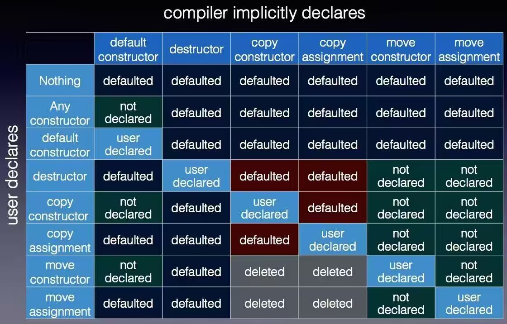

https://www.bilibili.com/video/BV1LY411H7Gg/


# 类
```cpp

```
## 构造函数
构造函数是定义在类中，用来初始化类成员变量的函数，如果没有为类编写任何构造函数，那么编译器会隐式生成下列默认构造函数，并且它们都是非`explicit`的：
- 默认无参构造函数
- 默认拷贝构造函数
- 默认拷贝赋值运算符
- 默认移动构造函数
- 默认移动赋值运算符
- 默认析构函数

当用户自定义这些构造函数时，它们会被隐式弃置，不参与重载决议

如果要显式生成这些构造函数，使用`default`关键字

如果希望显式弃置这些构造函数，可以使用关键字`delete`显式标记，经过`delete`标记的构造函数会参与重载决议，如果调用时匹配到这个重载，那么编译器就会报错（仅限移动构造？）
```cpp
struct Point {
    int x, y;

    Point(Point const &other) = delete; // 不生成默认无参构造函数
};
```

如果编写了有参构造函数，那就没有默认构造函数，如果还是希望有默认构造函数，那么可以使用`default`关键字
```cpp
struct Point {
    int x, y;

    Point() = defalt;
    Point(int x, int y) : this->x(x), this->y(y) {}
};
```

C++20 开始可以在调用构造函数时打乱初始化顺序
```cpp
Point() : m_x {}, m_y {} { }
Point(int x, int y) : m_x(x), m_y(y) { }
```
### 初始化列表
初始化列表中成员的顺序是类中成员定义的顺序

如果类成员是常量或引用，必须使用初始化列表

如果类成员没有无参构造函数，必须使用初始化列表

避免重复初始化，提高效率，如果在构造函数中进行赋值操作，那么实际上是先用无参构造函数初始化一遍，再在函数体内赋值了一遍
### 结构化绑定
```cpp
auto [a, b, c, d] = std::tuple {1, "asdf", 1.f, std::vector {1, 2, 3}};
```
### 析构函数
```cpp

```
### 运算符重载
### 二元比较运算符尽量重载为友元函数
如果希望将含有两个运算数的运算符重载函数写到class中，需要加friend关键字将其声明为友元，否则必须放到全局作用域
```cpp
//class Point作用域内
friend Point operator+(const Point& A, const Point& B) {
    return Point(A.m_x + B.m_x, A.m_y + B.m_y);
}

friend std::ostream& operator<<(std::ostream& ostream, const Point& A) {
    ostream << A.m_x << " " << A.m_y;
    return ostream;
}

friend std::istream& operator>>(std::istream& istream, Point& A) {
    istream >> A.m_x >> A.m_y;
    return istream;
}
```
### 类中的指针
现在有一个结构体 $Student$ 定义如下
```cpp
struct Student {
	int grade;
	int age;
	Student() : grade { 7 }, age { 14 } {}
};
```
指向类的指针和指向基本类型的指针相比只是在解引用时有一些不同，由于成员运算符 $.$ 的优先级高于间接寻址运算符 $*$，在通过类指针访问类对象的成员时必须加 $()$ 保证先解引用，语法比较麻烦


如果指针指向一个非基本类型，那么通过指针访问其成员时，必须先解引用，再使用成员运算符，这样的语法显然是非常繁琐的，
```cpp
Student stu;
Student* stu_ptr = &stu;
std::cout << (*stu1_Ptr).age << "\n";
// 输出 14
```
$C++$ 引入了箭头运算符 $->$ 来解决这个问题，从而能够方便地通过类指针访问类对象的成员
```cpp
std::cout << stu1_Ptr->age << "\n";
// 输出 14
```  
### 结构体 ( struct )
struct是访问权限默认为public的class，使用sturct关键字声明，其余部分和class相同
```cpp
struct Point 
{
    int m_x;
    int m_y;
    int GetX() const { return m_x; }
    int GetY() const { return m_y; }
    void SetX(int x) { m_x = x; }
    void SetY(int y) { m_y = y; }
};
```
上面的代码等同于下面的代码：
```cpp
class Point 
{
public:
    int m_x;
    int m_y;
    int GetX() const { return m_x; }
    int GetY() const { return m_y; }
    void SetX(int x) { m_x = x; }
    void SetY(int y) { m_y = y; }
};
```


### 联合体 ( union )
https://en.cppreference.com/w/cpp/language/union
```cpp
union U {
    long long i64;
    int i32;
}
```
### 类模板
### concept
### 编译期类模板参数推导 ( CTAD )
C++17 标准引入了 CTAD，